<p align="center">
  👨‍💻 <strong>Welcome to My Digital Realm!</strong> 👨‍💻
</p>

<p align="center">
  
</p>

```python
def about_me():
    return {
        "name": "30-year-old IT Guru",
        "experience": "15+ years",
        "passion": "Automation",
        "philosophy": "Enhance through automation",
        "belief": "Almost everything can be automated with the right mindset"
    }
```

## 🚀 About Me

I'm a **30-year-old IT Guru** with over **15 years** of navigating the digital landscape. My true passion lies in **automation**, where I thrive on enhancing existing products and services through intelligent automation. With a mindset geared towards efficiency, I believe that almost everything in today's world can be automated, given the right approach.

## 🌟 What You'll Find Here

This repository marks a significant shift in my approach to creation. Up until now, my projects have been crafted in solitude, each a testament to my philosophy of making things better through automation. Here, I aim to change that. I invite you to explore my work, use it, and be inspired to take what I have created and make it even better. Together, we can inspire a community of like-minded individuals to create things that may have never been conceived without the spark of inspiration from others' work. Let's grow together, fostering an environment where innovation thrives on collaboration and shared vision.
